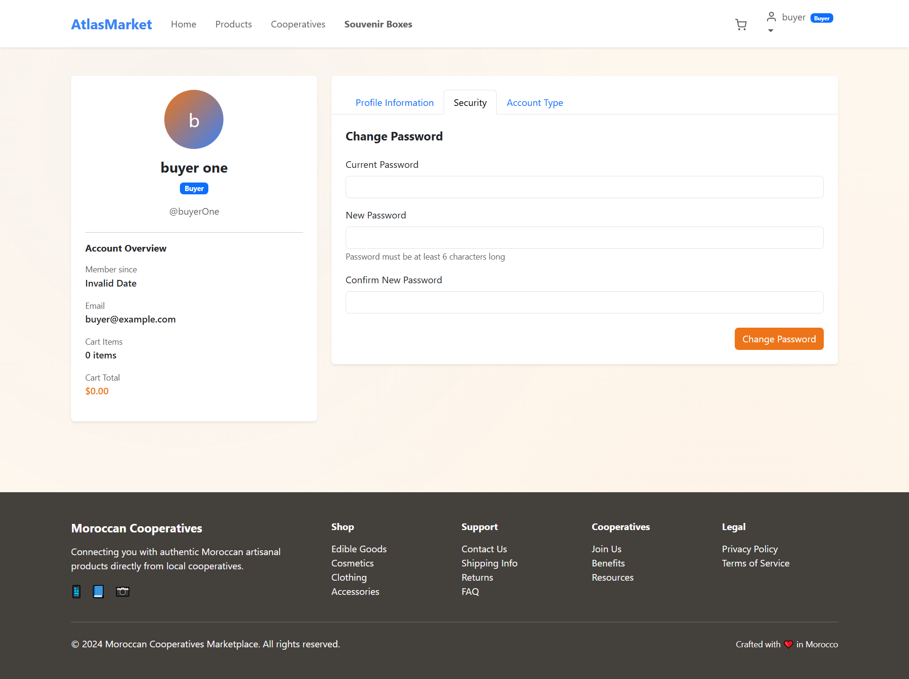
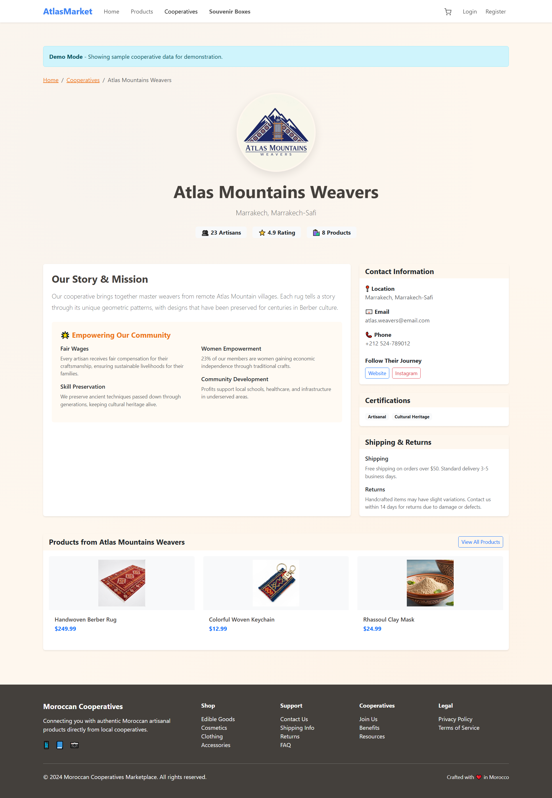

## **E-MARKET-MERN - E-Commerce Marketplace Platform**

           
                      
                                 

A full-stack e-commerce marketplace platform built with the MERN stack, featuring multi-role access for Admin, Sellers, and Buyers with comprehensive dashboard management capabilities.

**🚀 Features**

*👑 Admin Features :*

- Dashboard Overview - Comprehensive site analytics and performance metrics
- User Management - Manage all users, roles, and permissions
- Site Management - Control platform settings and configurations
- Order Monitoring - Track all transactions across the platform
- Category Management - Organize and manage product categories

*🛍️ Seller Features:*

- Seller Dashboard - Sales analytics and performance insights
- Inventory Management - Add, edit, and manage product listings
- Product Creation - Rich product creation with image uploads
- Order Management - Process and track customer orders
- Sales Analytics - View sales reports and revenue metrics

*👤 Buyer Features:*

- Product Browsing - Search and filter products by categories
- Shopping Cart - Add items and manage quantities
- Order System - Place orders and track order status
- Order History - View past purchases and order details
- Profile Management - Update personal information and preferences

**🛠️ Tech Stack **

*Frontend:*
 - React.js
 - Context API for state management
 - CSS3 with modern styling & bootstrap
 - Axios for API calls

*Backend:*
 - Node.js
 - Express.js
 - MongoDB with Mongoose
 - JWT Authentication
 - File upload handling

## 📁 Project Structure

| Backend (`/backend`) | Frontend (`/frontend`) |
|---------------------|-----------------------|
| `config/` - Database configuration | `public/` - Static assets |
| `controllers/` - Business logic | `src/components/` - React components |
| `locales/` - Internationalization | `src/contexts/` - State management |
| `middleware/` - Auth & validation | `src/pages/` - Page components |
| `models/` - MongoDB schemas | `src/services/` - API services |
| `routes/` - API endpoints | `src/utils/` - Utility functions |
| `uploads/` - File storage | `App.js` - Main component |
| `utils/` - Helper functions | `package.json` - Dependencies |
| `.env` - Environment variables | |
| `index.js` - Entry point | |

**🚀 Installation & Setup**
*Prerequisites*
- Node.js (v18 or higher)
- MongoDB (local or Atlas)
- npm or yarn

## Backend Setup

1. Navigate to backend directory:
 - cd backend
2. Install dependencies :
 - npm install
3. Environment Configuration:
 - Create a .env file in the backend directory with:
   * PORT=5000
   * MONGODB_URI=mongodb://localhost:27017/emarket
   * JWT_SECRET=your_jwt_secret_key
   * NODE_ENV=development
4. Start the backend server:
 - npm start
 - *Backend will run on http://localhost:5000*

## Frontend Setup

1. Navigate to frontend directory:
   - cd frontend
2. Install dependencies:
   - npm install
3. Start the frontend development server:
   - npm start
   - *Frontend will run on http://localhost:3000*

**🔑 API Endpoints**
- Authentication :
  * POST /api/auth/register - User registration
  * POST /api/auth/login - User login
  * GET /api/auth/me - Get current user
  
- Products :
  * GET /api/products - Get all products
  * POST /api/products - Create new product (Seller)
  * PUT /api/products/:id - Update product
  * DELETE /api/products/:id - Delete product

- Orders :
  * POST /api/orders - Create new order
  * GET /api/orders - Get user orders
  * PUT /api/orders/:id - Update order status

- Users :
  * GET /api/users - Get all users (Admin)
  * PUT /api/users/:id - Update user role

## 👥 User Roles & Permissions
| Role | Dashboard Access | Product Management | Order Management | User Management |
|------|------------------|--------------------|------------------|-----------------|
|**Admin**| Full dashboard | View all Products | All orders | Full access |
|**Seller**| Seller dashboard | Own products only | Own product orders | Limited |
|**Buyer**| Order history only | None | Own orders only | Self-only |

 ## 🖼️ Application Screenshots

### Core Pages
| Page | Description | Screenshot |
|------|-------------|------------|
| **Home Page** | Main landing page of the application |  |
| **Products Page** | Browse all available products |  |
| **Cooperatives Page** | View all cooperatives |  |
| **Souvenir Boxes Page** | Special souvenir boxes section |  |

### Authentication
| Page | Description | Screenshot |
|------|-------------|------------|
| **Login Page** | User authentication page |  |
| **Register Page** | New user registration |  |

### User Profiles
| Profile Type | Description | Screenshot |
|-------------|-------------|------------|
| **Buyer Profile** | Buyer user profile interface |  |
| **Buyer Profile Details** | Additional buyer profile views |   |
| **Seller Profile** | Seller profile interface |  |
| **Admin Profile** | Administrator profile interface |  |

### Buyer Features
| Feature | Description | Screenshot |
|---------|-------------|------------|
| **Shopping Cart** | Buyer's shopping cart page |  |

### Cooperative Details
| Cooperative | Description | Screenshot |
|------------|-------------|------------|
| **Cooperative Cards** | Individual cooperative profile cards |      |

### Seller Dashboard
| Section | Description | Screenshot |
|---------|-------------|------------|
| **Seller Overview** | Main seller dashboard overview |  |
| **Product Creation** | Create new product listings |  |
| **Order Management** | Manage customer orders |  |
| **Inventory Management** | Track and manage inventory |  |

### Admin Dashboard
| Section | Description | Screenshot |
|---------|-------------|------------|
| **Platform Overview** | Admin main dashboard overview |  |
| **User Management** | Manage system users and roles |  |
| **Platform Analytics** | Analytics and reporting |  |
| **System Settings** | Platform configuration |  |

**👨‍💻 Developers**
IMANE TAIFOUR | KHAOULA BOUMAROUANI
* GitHub : @Imanet4 | ...
* Email : imanetaifour2@gmail.com | khawlaboumarwani@gmail.com

##📄 License
Distributed under the MIT License. See LICENSE for more information.
